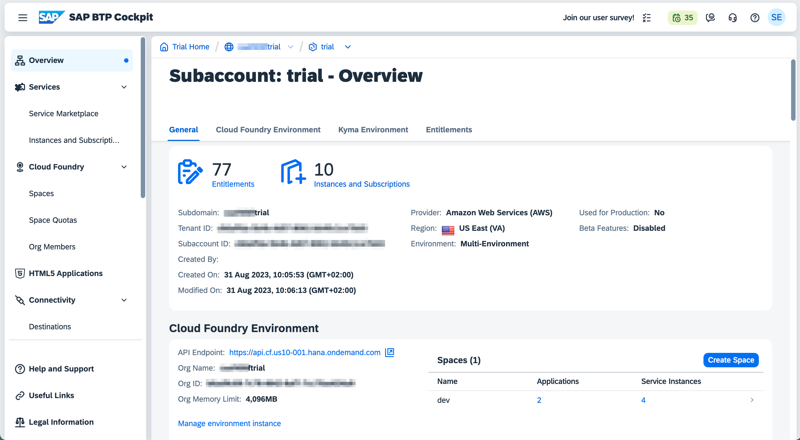

# Homework Exercise

The goal of this homework exercise is four you to prepare your SAP Business Technology Platform (BTP) Trial Account to
deploy this application, to deploy the application as is from this repository and then do some changes to this
application and deploy those changes to your BTP Trial Account. To hand in your Homework to your supervisors, create
a screenrecording of your app.

# Step 1: Prepare your SAP BTP Trial Account

The Multi-Target Application in this repository requires a Cloud Foundry environment with the following services:

-   [Application Logging](https://discovery-center.cloud.sap/serviceCatalog/application-logging-service)
-   [HTML5 Application Repository
    Service](https://discovery-center.cloud.sap/serviceCatalog/html5-application-repository-service)
-   [Destination Service](https://discovery-center.cloud.sap/serviceCatalog/destination)
-   [Authorization and Trust Management Service
    (XSUAA)](https://discovery-center.cloud.sap/serviceCatalog/authorization-and-trust-management-service)
-   [SAP HANA HDI Container](https://discovery-center.cloud.sap/serviceCatalog/sap-hana-cloud)

To checkout and deploy the application you can use either
[SAP Business Application Studio](https://discovery-center.cloud.sap/serviceCatalog/business-application-studio) on BTP
or [Microsoft Visual Studio Code](https://code.visualstudio.com) with extensions.

To create HDI Containers on BTP, you need a
[SAP HANA Cloud](https://discovery-center.cloud.sap/serviceCatalog/sap-hana-cloud) instance and to create a Fiori
Launchpad for your applications you need an instance of
[SAP Build Work Zone, standard edition](https://discovery-center.cloud.sap/serviceCatalog/sap-build-work-zone-standard-edition).

## Step 1.1: Create your SAP BTP Trial Account

Follow the tutorial [Get a Free Account on SAP BTP Trial](https://developers.sap.com/tutorials/hcp-create-trial-account.html)
and create your own BTP Trial account. Please use your university or school email address if possible.

At the end of this step, you should have access to the Cockpit of your BTP Trial account.

## Step 1.1: Create a SAP HANA Cloud Instance

Follow the tutorial [Deploy SAP HANA Cloud](https://developers.sap.com/tutorials/hana-cloud-deploying.html).

Make sure you note the password for the DBADMIN user in a safe location. And make sure to configure the HANA database to accept connections from all IP addresses. (Step 2 - #1)

The creation of the SAP HANA Cloud instance takes some time (more than 10 minutes).

## Step 1.2: Create a SAP Build Work Zone, standard edition subscription

Follow the tutorial [Set Up SAP Build Work Zone, standard edition Using a Trial Account](https://developers.sap.com/tutorials/cp-portal-cloud-foundry-getting-started.html) to create a subscription to SAP Build Work Zone standard edition in your
BTP Trial account and add your user as a Work Zone administrator.

# Step 2: Checkout the app and deploy to BTP

Now we want to checkout the application from GitHub in SAP Business Application Studio (BAS) and deploy it to the
Cloud Foundry (CF) environment of our subaccount on BTP. After the deployment is successful, we want to add our apps
to a Fiori Launchpad (FLP) in SAP Build Work Zone, standard edition.

## Step 2.1: Create a Development Space in BAS

Navigate to the subaccount of your BTP Trial account in the BTP Cockpit and go to "Instances and Subscriptions". Open
SAP Business Application Studio.


Create a new Development Space for "Full Stack Cloud Application".

When your dev space has been started, open it by clicking on the name.

## Step 2.2: Checkout the project

In the "Get Started" screen of BAS, choose "Clone from Git" and provide the Repository URL: `https://github.com/sebastianesch/cap-project-portfolio.git`.

You can now close the "Get Started" view. In the "Explorer" view on the left you should see the files and folders of
the application project cloned from Git.

## Step 2.3: Build the MTA archive

> [!WARNING]
> Before you build the MTA archive, make sure to install the required packages via `npm install`.

You can initiate the build of the MTA archive for the appliction by either right-clicking on the `mta.yaml` file in the
Explorer and then clicking on the "Build MTA Project" command in the context menu or by opening a Terminal (via the Menu
in the upper left > Terminal > New Terminal) and typing `mbt build`.

The MTAR file is created in the folder `mta_archives`.

## Step 2.4: Deploy the MTA archive

To deploy the MTA application to your BTP subaccount, open the `mta_archives` folder and select "Deploy MTA Archive"
from the context menu, or use the terminal and type `cf deploy mta_archives/project-portfolio_1.0.0.mtar`.

In order to interact with the Cloud Foundry environment, you need to login to Cloud Foundry. You need to know the API
Endpoint of your Cloud Foundry environment. You can find this information in the BTP Cockpit on the Overview of your
subaccount.



If you use the context menu to deploy, you will get a wizard to authenticate to Cloud Foundry. Enter the URL for the
CF API and then choose "SSO Passcode" and click on the link "Open a new browser page to generate your SSO passcode".

In the new tab, click on "Use default Identity Provider" and copy the passcode in the next screen. You can click the
copy to clipboard icon next to the passcode.

Close the tab and paste the passcode into the field in the wizard in BAS. In the next screen of the wizard you have to
select the Cloud Foundry Organisation and Space you want to connect to. (There is only one Org and Space in your trial
account).

You can also login to CF via the command line, following the same procedure. Enter `cf login --sso -a <CF API URL>` into
the terminal and press enter. Click on the link in the "Temporary Authentication Code ( Get one at
http://login.\<CF Region\>.hana.ondemand.com/passcode ):"
message, copy the passcode and paste it into the terminal and press enter.

When you are logged in to CF, you will see the information to which Cloud Foundry Organisation and Space you are
connected.

```
Authenticating...
OK


Targeted org xxxxxxxxtrial.

Targeted space dev.

API endpoint:   https://api.cf.us10-001.hana.ondemand.com
API version:    3.132.0
user:           your.name@example.com
org:            xxxxxxxxtrial
space:          dev
```

The deployment takes some time. At the end you should see the following in your terminal window:

```
Application "cap-project-portfolio-srv" started and available at "xxxxxxxxtrial-dev-cap-project-portfolio-srv.cfapps.us10-001.hana.ondemand.com"
Skipping deletion of services, because the command line option "--delete-services" is not specified.
Process finished.
Use "cf dmol -i 00xx0x0x-xx00-00xx-xxx0-xxxx0x0x0000" to download the logs of the process.
```

## Step 2.5: Create Fiori Launchpad Configuration

Navigate to the subaccount of your BTP Trial account in the BTP Cockpit and go to "Instances and Subscriptions". Open
SAP Build Work Zone, standard edition.


_If you get an "Access Denied" error message, you have to add your user to the Role Collection "Launchpad_Admin" in the
BTP Cockpit in Security > Role Collections. (See Step 1.2)_

### Create a new Site

Create a new Site "Launchpad". Go back to the Site Directory, click the three dots on the card representing your site
and choose "Manage Site Alias" and set it to "launchpad".

### Update your Content Provider

Navigate to the "Channel Manager" in the left menu. For the "HTML5 Apps" Channel, click the Refresh Action in the Actions
section on the right of the table. Wait for the Status to change to "Updated".

_**Attention:** Everytime you change your HTML5 Apps, you have to perform a Refresh of the Content Channel, otherwise the
old version of your app will be displayed._

### Add Content to Your Content

Navigate to the "Content Manager" in the left menu. Click on the "Content Explorer" button and then click on the "HTML5 Apps"
Content Channel. You should see two apps in the list: Customers and Projects. Select both apps
and click on "Add".

### Create a Group for your Apps

Switch back to the "Content Manager" via the breadcrumb navigation. You should now see the Role "Everyone" and the three apps you added in the previous
step. Note that they have "HTML5 Apps" as Channel, the Role has "Local" as Channel.

Click on "Create" and select "Group" to create new tile group for the Launchpad. Name the Group "Project Portfolio"
and assign both apps to your group. Save your group.

### Create a Role for your Site

In the "Content Manager", click on "Create" and select "Role" to create a new Role for your Launchpad.

-   **Title:** Project Portfolio Admin
-   **ID:** project_portfolio_admin
-   **Description:** Admin for the Project Portfolio App

Assign both apps to the role and click on save to save your role.

### Add to the Role to your Site

Navigate to the "Site Directory" and click on the cogwheel icon to open the "Site Settings". Click on "Edit" in the
upper right corner of the main panel and then search field of the "Assign Items" panel. Add the role we created
previously to the Site and save.

If you open your Site by clicking on the share icon on your Site in the Site Directory, you will see an empty Launchpad.
Your user is not yet assigned to the Role we just created. This will happen in the next step.

## Step 2.6: Update Role Collections and assign your User

Go to the BTP Cockpit and navigate to the "Role Collections" of your subaccount. You should see a Role Collection named
"project_portfolio_admin", just like the role we created in the SAP Build Work Zone. If you don't see the Role (e.g.
because the list was open in the Cockpit while you configured the Launchapd), refresh the page.

Click on the Role Collection "project_portfolio_admin". On the right side, the details for the Role Collection become
visible. Click on "Edit" to change the Role Collection.

We need to add the roles defined by the CAP Application backend and we need to assign our user to the Role Collection.

### Add required role

In the first section "Roles" click on the value help icon for the "Role Name" field. In the dialog that appears, set
the filter for "Application Identifier" to "cap-roject-portfolio-\<your app identifier\>". The only visible role should be
the "User" role of the Project Portfolio app. Select it and click "Add" at the bottom of the dialog.

### Add your user

In the section "Users" you can start typing your e-mail address into the "ID" field. The value help will suggest your
trial user with the Identity Provider "Default Idenity Provider".

## Step 2.7: Confirm your Configuration

After you have completed the configuration of your Launchpad and the Role Collection, you should be able to see the
results in your Launchpad. But at the moment you will only see an empty Launchpad. You have to either open the URL
of your Launchpad in an incognito window of your browser, a different browser or you have to logoff from SAP ID Service
and login again.

Copy the link to your Launchpad and open it in an incognito window of your browser. You should now see the Lauchpad
with two tiles for the Customers and Projects app.

# Step 3: Modify the application and deploy your changes

Next, you have to do some small changes to the application and deploy those changes to your BTP trial account.

## Step 3.1: Modifications

We want to add a "City" attribute to our customers, so your task is to:

-   extend the Customers entity in `db/schema.cds` with a city attribute (including a translateable label)
-   add the translation for the label to the `i18n/i18n.properties` file
-   add example data for the city attribute in the `db/data/projectportfolio.db-Customers.csv` file

You can test your modifications without deploying to SAP BTP by running your app via `cds watch`. You should see the
additional city attribute and your example data when you call the OData services for customers and projects.

We also want to show the "City" attribute in the Customers app, so your task is to:

-   add the city attribute to the LineItem for the customers app in `app/customersapp/annotations.cds`
-   add the city attribute to the CustomerData FieldGroup in `app/customersapp/annotations.cds`

## Step 3.2: Build & Deployment

Build your MTA Archive either via the context menu or the mbt build tool. Then deploy your MTAR file again either via
the context menu or the cf CLI (see 2.3 and 2.4). After successful deployment go to the Launchpad Admin app, navigate
to the Channel Manager and update the "HTML5 Apps" Content Channel.

Now your changes should be visible in the Launchpad in your BTP trial account.

# Step 4: Send confirmation of your results to your supervisors

Please create a screencast of the Launchpad in your BTP trial account. Make sure that the URL of your browser is
visible. Start with an fresh incognito window of your browser.

1. Open the BTP Cockpit (https://account.hanatrial.ondemand.com/trial/) and login
1. Navigate to your Subaccount > Services > Instances and Subscriptions
1. Open the SAP Build Work Zone, standard edition application
1. Go to your Launchpad Site
1. Go to the Customers Application, and click Go in the Filter Bar - the new City column should be visible
1. Navigate to one of the Customers - the new City field should be visible

Save the screen recording and submit it to your course supervisors as explained in the lecture.
