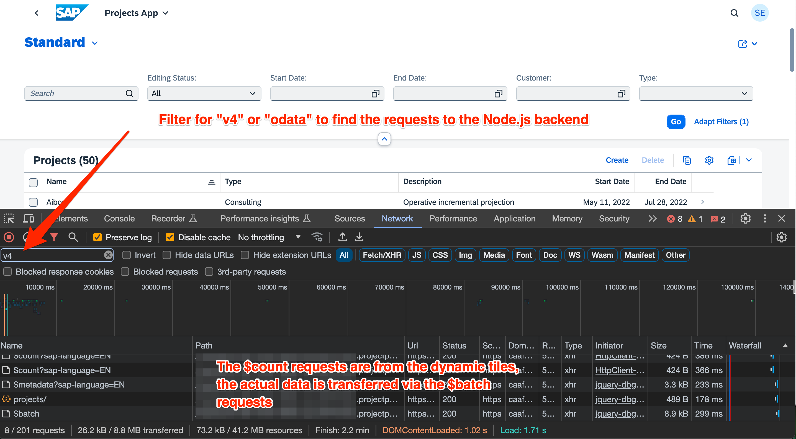

# Troubleshooting Tips

## MTA Build Issues

Before you build the MTA archive, make sure to install the required packages via `npm install`.

## Connectivity Issues

When your apps in the launchpad show erors instead of number for customes or projects or you can't load data in the apps
you need to check the root cause of the issue.

You can check connectivity issues in the Network tab of the Developer Tools in your browser. To see only the requests
to your CAP application, you have to filter the requests, otherwise you will see a lot of requests for UI5 resources,
that are not relevant for connectivity issues with your CAP backend.

In the examples we use OData V4 for the apps, so the backend URLs all start with `/odata/v4/...`, so filtering on `v4` shows
only requests to the backend.

Things to check:

-   Is your CAP App running? Check in the Applications section of your Cloud Foundry space. (404 Not Found Error)
-   Is your HANA Cloud Instance started? Check in the HANA Cloud section of your Cloud Foundry space. (500 Internal Server Error)
-   Is your Role Collection setup correctly? Check in the Role Collections section of your Subaccount. (403 Forbidden Error)

## Role Collection Setup

Your role collection has to have the same name as the Role in SAP Build Work Zone. The Role Collection has to include the three roles
`CustomerAdmin`, `User` and `Token_Exchange` from the `cap-project-portfolio` application. The Role Collection has to be assigned
to your user. And finally make sure to logout and login again after you have changed your Role Collection.

## cap-project-portfolio-db-deployer App

After deployment, the `cap-projeect-portfolio-db-deployer` app is in status stopped. This is fine - you don't need to start this app manually, it is run automatically when you deploy your MTA file.